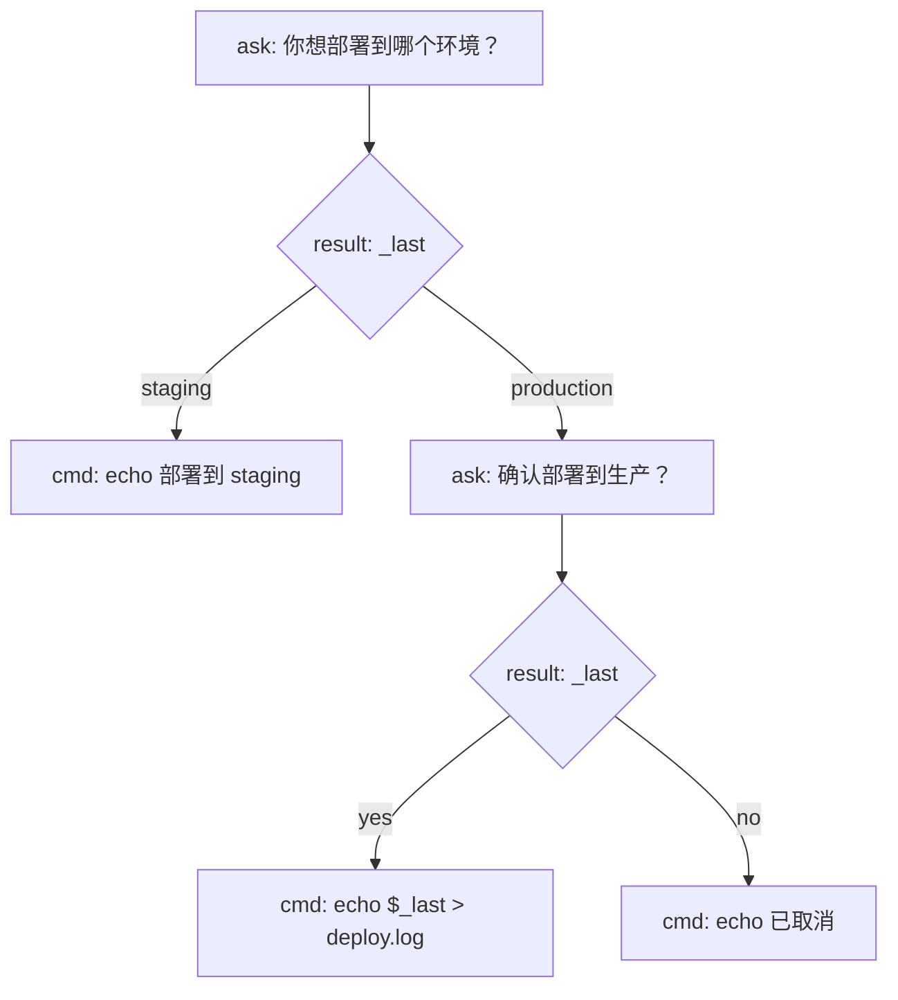

# Yield Agent Skill

使用 `yield-run` CLI 工具管理支持暂停/恢复的 shell 脚本（yield 脚本）。

## 两种脚本来源

| 来源 | 格式 | 说明 |
|------|------|------|
| 直接编写 | `.sh` | 手写 yield shell 脚本 |
| Mermaid 编译 | `.mmd` | 用流程图描述逻辑，编译为 yield 脚本 |

## 前置条件

- `yield-run` 和 `yield-wrapper.sh` 必须位于同一目录或 PATH 中
- `.mmd` 文件需要 `yield-mermaid` CLI（位于 `mermaid-compiler/` 目录）

## yield-run 命令参考

| 命令 | 用途 |
|------|------|
| `yield-run run '<command>'` | 启动可 yield 的脚本，输出 JSON，阻塞到首次 yield 或完成 |
| `yield-run resume <session_id> <response>` | 恢复暂停的会话，传递响应数据 |
| `yield-run wait <session_id>` | 等待会话下一次 yield 或完成（默认超时 30 秒） |
| `yield-run list` | 列出所有活跃会话（JSON 数组） |
| `yield-run kill <session_id>` | 终止指定会话 |
| `yield-run clean` | 清理已死会话 |

## yield-mermaid 命令参考

| 命令 | 用途 |
|------|------|
| `yield-mermaid run <file.mmd>` | 编译 .mmd 并直接执行（内部调用 yield-run） |
| `yield-mermaid compile <file.mmd>` | 只编译，输出到 stdout |
| `yield-mermaid compile <file.mmd> -o output.sh` | 编译并写入指定文件 |
| `yield-mermaid validate <file.mmd>` | 验证 Mermaid 语法 |

## JSON 输出格式

所有命令输出 JSON，`type` 字段标识消息类型：

```json
{"type":"yield","message":"脚本请求的内容","session_id":"session_xxx"}
{"type":"done","session_id":"session_xxx"}
{"type":"error","message":"错误描述","session_id":"session_xxx"}
{"type":"timeout","session_id":"session_xxx","message":"等待超时"}
```

## Agent 工作流程（自动循环）

当你需要运行 yield 脚本（.sh 或 .mmd）时，按以下循环操作：

### 启动脚本

- `.sh`：`yield-run run '<script.sh>'`
- `.mmd` 编译后执行：`yield-mermaid compile <file.mmd> -o /tmp/out.sh && yield-run run '/tmp/out.sh'`
- `.mmd` 直接运行：`yield-mermaid run <file.mmd>`

收到 `{type:"yield", message:"..."}` 后进入循环。
```

## 编写 yield 脚本

在脚本中使用 `yield "问题"` 暂停执行，`yield` 的参数是发给 agent 的问题/请求，agent 会回答并传回：



对应的 shell 脚本：

```bash
#!/bin/bash
# 脚本向 agent 提问，agent 回答的名字通过变量接收
name=$(yield "我需要一个数据库表名，请给出一个合适的名字")
echo "使用表名: $name"

# 脚本向 agent 请求决策
choice=$(yield "数据量大约100万行，应该用分区表还是普通表？")
echo "采用方案: $choice"

# 脚本让 agent 检查结果
review=$(yield "执行完毕，以下是输出摘要，请检查是否有异常：\n$(cat /tmp/build.log)")
echo "agent 评估: $review"
```

## 环境变量

| 变量 | 默认值 | 说明 |
|------|--------|------|
| `YIELD_TIMEOUT` | 30 | `wait` 命令超时秒数 |

## 注意事项

- `yield` 函数由 `yield-wrapper.sh` 自动注入，脚本无需自行定义
- 每次 `yield` 调用会阻塞直到收到 `resume` 响应
- 会话数据存储在 `/tmp/yield-sessions-$USER/` 或 `~/.yield-sessions/`
- `clean` 命令可定期调用以清理僵尸会话
- `.mmd` 文件中 `ask:` 节点的文本会作为 `yield` 的参数发送给 agent
- `.mmd` 文件中 `cmd:` 节点的文本直接作为 shell 命令执行
- `.mmd` 文件中 `result:` 菱形节点用于条件分支，分支标签（`|label|`）与用户回答精确匹配
- **mmd 节点文本中禁止使用双引号**：Mermaid 解析器会把 `"` 当作字符串定界符，导致解析失败。正确写法：
  - 纯文本：`cmd: echo 你好`（无需引号）
  - 含变量：`cmd: echo $_last`（不加引号，生成器自动包裹为 `echo "$_last"`）
  - ask 节点内需要引号时用单引号：`ask: 回复'一天'或'两天'`
- **区分问用户 vs AI 任务**：message 面向用户（"你想去哪？"）→ 转达给用户；message 面向 AI（"搜索天气"）→ 自己执行
