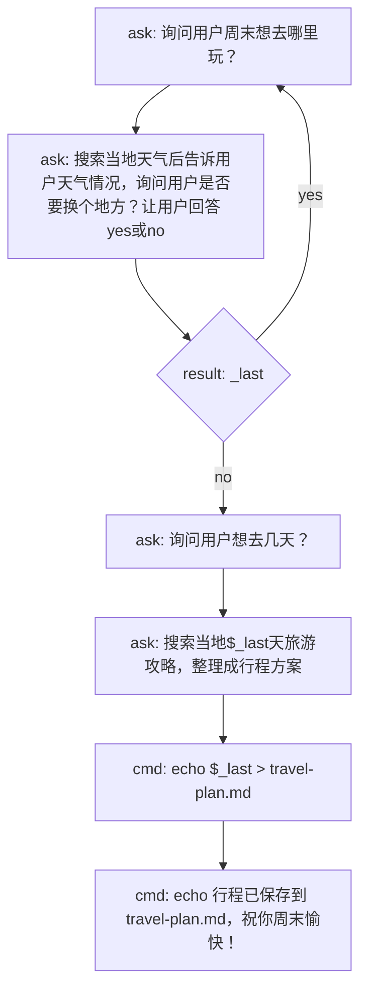
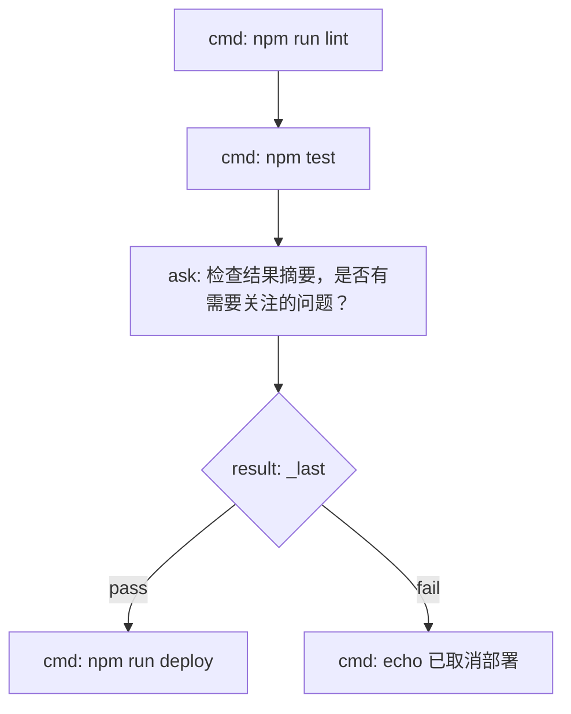
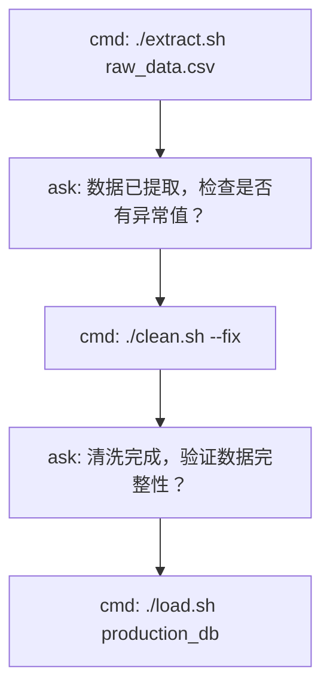
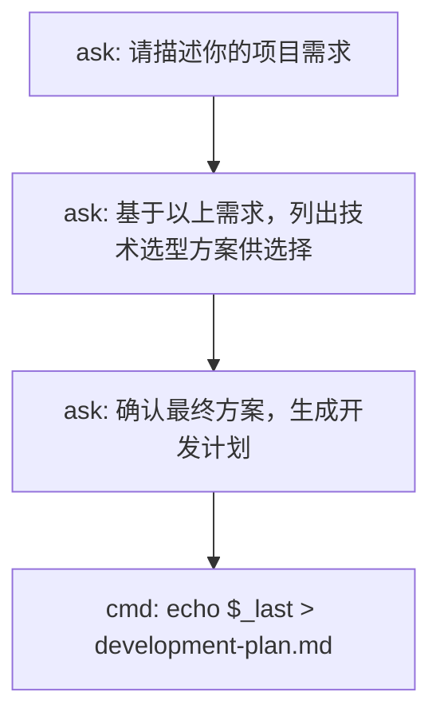

# YieldAgent

Mermaid 驱动的轻量级 Agent 工作流引擎

## 为什么需要 YieldAgent

LLM 擅长单步执行——回答问题、生成内容、分析数据。但在多步任务中，模型会偏离流程、遗忘前置条件、自作主张跳过步骤。

现有的编排工具（Dify 等）功能强大，但需要部署基础设施，有学习成本。

YieldAgent 的思路很简单：**用流程图定义"做什么"，让模型只负责"怎么做"。** 编排逻辑从模型的脑袋移到确定性的脚本中——模型在每个节点上执行单步任务，流程图控制整体走向。

## 看一个例子

用 Mermaid 定义一个周末旅行规划的工作流：



编译为可执行的 yield 脚本：

```bash
yield-mermaid compile weekend-trip.mmd
```

```bash
#!/bin/bash
# Generated from weekend-trip.mmd by yield-mermaid

while true; do
  _last=$(yield "询问用户周末想去哪里玩？")
  A="$_last"
  _last=$(yield "搜索当地天气后告诉用户天气情况，询问用户是否要换个地方？让用户回答 yes或no")
  B="$_last"
  case "$_last" in
    yes) continue ;;
    no) break ;;
  esac
done
_last=$(yield "询问用户想去几天？")
F="$_last"
_last=$(yield "搜索当地$_last天旅游攻略，整理成行程方案")
H="$_last"
echo "$_last" > travel-plan.md
echo 行程已保存到 travel-plan.md，祝你周末愉快！
```

运行后，Agent 依次收到提问并回答：

```json
{"type":"yield","message":"询问用户周末想去哪里玩？","session_id":"session_xxx"}
```
```bash
# Agent 回答后，脚本继续
yield-run resume session_xxx "杭州"
```
```json
{"type":"yield","message":"搜索当地天气后告诉用户天气情况，询问用户是否要换个地方？让用户回答 yes或no","session_id":"session_xxx"}
```
```bash
yield-run resume session_xxx "no"
```
```json
{"type":"yield","message":"询问用户想去几天？","session_id":"session_xxx"}
```

流程图保证了执行顺序，Agent 不会跳步或遗忘。

## 更多场景

**代码审查流程：**



**数据处理管道：**



**多轮对话任务：**



## 快速开始

```bash
# 克隆仓库
git clone git@github.com:JackieAnxis/YieldAgent.git
cd YieldAgent

# 运行基础示例
./yield-run run './demo.sh'

# 编译并运行 Mermaid 工作流
cd mermaid-compiler && npm install
node src/cli.js run examples/weekend-trip.mmd
```

## 核心概念

### yield 语法

在脚本中使用 `yield "问题"` 暂停执行，等待 Agent 回答：

```bash
name=$(yield "请给出一个适合存储用户日志的表名")
echo "使用表名: $name"
```

### 节点类型（Mermaid）

| 前缀 | 用途 | 示例 |
|------|------|------|
| `cmd:` | 执行 shell 命令 | `[cmd: echo hello]` |
| `ask:` | 向 Agent 提问 | `[ask: 选择哪个环境？]` |
| `result:` | 条件分支 | `{result: _last}` |

### 会话管理

```bash
yield-run list      # 列出活跃会话
yield-run kill <id> # 终止会话
yield-run clean     # 清理已结束的会话
```

## CLI 参考

**yield-run：**

```
yield-run run '<command>'              启动可 yield 的脚本
yield-run resume <session_id> <text>   恢复暂停的会话
yield-run wait <session_id>            等待下次 yield 或完成
yield-run list                         列出活跃会话
yield-run kill <session_id>            终止会话
yield-run clean                        清理已结束的会话
```

**yield-mermaid：**

```
yield-mermaid run <file.mmd>                      转译并执行
yield-mermaid compile <file.mmd> [-o output.sh]   只转译不执行
yield-mermaid validate <file.mmd>                  验证 Mermaid 语法
```

## 架构

```
Mermaid 流程图 (.mmd)
    ↓
yield-mermaid 编译
    ├── parse: 解析 Mermaid 语法
    ├── analyze: 图遍历、环检测
    └── generate: AST → shell 脚本
    ↓
Shell 脚本 (.sh)
    ↓
yield-run 执行
    ├── FIFO 管道通信
    └── 会话生命周期管理
    ↓
Agent (Claude) 响应
```

底层通过命名管道（FIFO）实现阻塞式 IPC，脚本和 Agent 之间实时双向通信。

## 项目结构

```
YieldAgent/
├── yield-run              # CLI 入口
├── yield-wrapper.sh       # 核心引擎（FIFO + 会话管理）
├── demo.sh                # 基础示例
├── mermaid-compiler/      # Mermaid 编译器
│   ├── src/
│   │   ├── parser.js      # Mermaid 解析
│   │   ├── analyzer.js    # 图分析
│   │   ├── generator.js   # 代码生成
│   │   └── cli.js         # CLI 入口
│   └── examples/          # 示例流程图
└── .claude/skills/        # Claude Code Skill
```

## License

MIT
